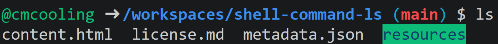

The `ls`{.bash} command is used to list the contents of the current working directory. It is available in shells in many Unix-like operating systems. Some shells with support for the `ls`{.bash} command include:

* `bash`
* `zsh`
* `PowerShell` (not a Unix-like system: here `ls`{.powershell} is technically an alias for `Get-ChildItem`{.powershell})

An example output may look like the following:



In the above example, the files in the current directory are listed, along with the name of a directory highlighted in green. Note that the exact formatting of the output can vary depending on the shell and its configuration.

# Specifying A Directory

To list the contents of a specific directory, you can provide its path as an argument to the `ls`{.bash} command. This path may be relative to the current working directory or absolute. For example:

```bash
ls local_directory
ls /absolute/path/to/directory
```

# Try it Yourself

At the top of the page is a link to a Codespace. Click it and open the terminal. Try using the `ls`{.bash} command to list the contents of the entire workspace, and then of the `resources` directory.
